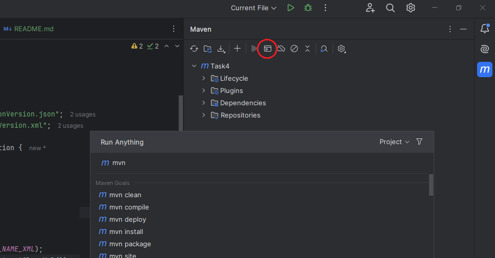

### Задание
```
Создать структуру классов Student, Subject, Class.  
Создать несколько экземпляров объектов и сохранить в файле, так чтобы потом можно было их воссоздать. 
Прочитать экземпляры из файла и восстановить объекты

- В качестве метода сериализации использовать XML (Apache XMLBeans) и JSON (fasterxml)  
```


Для сериализации `xml`-файлов при помощи технологии [Apache XMLBeans](https://xmlbeans.apache.org/) необходимо добавить зависимость в Maven из центрального репозитория или добавить файл `jar` в локальный репозиторий Maven.  
Для этого ввести команду в консоль Maven:

```
mvn install:install-file -Dfile=<path-to-file>.jar -DgroupId=<group-id> -DartifactId=<artifact-id> -Dversion=<version> -Dpackaging=jar
```
где заменить `<path-to-file>`, `<group-id>`, `<artifact-id>` и `<version>` на соответствующие значения.



После того как `jar` файл будет добавлен в локальный репозиторий Maven, его можно будет использовать как обычную зависимость в `pom.xml` файле:

```xml
<dependency>  
    <groupId>group-id</groupId>  
    <artifactId>artifact-id</artifactId>  
    <version>version</version>
</dependency>
```

Перед сериализацией данных, необходимо:
- создать `xsd` файл с описанием `xml`-схемы нужных классов,
- сгенерировать `jar` файл с этими классами при помощи утилиты [scomp](https://xmlbeans.apache.org/guide/Tools.html#scomp) из `Apache XMLBeans`, используя команду:

```
scomp -out filePath\fileName.jar filePath\fileName.xsd
```

Сгенерированные `jar`-файлы следует разместить в отдельной папке и добавить её в `classpath` IDE. Для этого выбрать `Project Settings` -> `Libraries` -> `+` -> `Java`. Тогда сгенерированные классы будут доступны для импорта.

